# 🕐 **Unit 2: Deep Sleep - Timer Wake Up**
*Membangunkan ESP32 dengan Jadwal yang Presisi*

---

## 🎯 **Tujuan Pembelajaran**

Setelah menyelesaikan unit ini, Anda akan mampu:

✅ **Memahami konsep dasar timer wake-up** pada ESP32 deep sleep mode  
✅ **Mengimplementasikan sistem "alarm clock"** yang menghemat baterai hingga 99%  
✅ **Mengelola data persistent** menggunakan RTC memory yang tetap hidup saat deep sleep  
✅ **Membuat aplikasi monitoring berkala** yang dapat beroperasi berbulan-bulan tanpa charger  
✅ **Mendiagnosis dan mengatasi masalah** deep sleep dalam project nyata  

---

## 🌟 **Mengapa Timer Wake-up itu Powerful?**

Bayangkan Anda memiliki asisten digital yang bisa "tidur" selama 23 jam 59 menit, lalu bangun tepat 1 menit untuk melakukan tugasnya, kemudian tidur lagi. Itulah kekuatan timer wake-up ESP32!

### **Analogi Sederhana: Alarm Clock Pintar**

Timer wake-up bekerja seperti alarm clock yang sangat canggih:

🕐 **Setting Waktu:** Anda tentukan kapan ESP32 harus bangun  
😴 **Deep Sleep:** ESP32 "tidur nyenyak" dengan konsumsi daya hanya 10µA  
⏰ **Wake Up:** Tepat waktu, ESP32 bangun dan menjalankan program  
🔄 **Repeat:** Siklus ini bisa diulang secara otomatis  

**Perbandingan Konsumsi Daya:**
- **Mode Normal:** ~240mA (ESP32 aktif terus)
- **Deep Sleep + Timer Wake-up:** ~10µA (99.996% lebih hemat!)

---

## 🔧 **Bagaimana Timer Wake-up Bekerja?**

### **Anatomi Sistem Timer Wake-up**

ESP32 memiliki komponen khusus yang tetap hidup bahkan saat deep sleep:

```
┌─────────────────────────────────────────┐
│            ESP32 Architecture           │
├─────────────────────────────────────────┤
│  🛌 POWERED OFF (Deep Sleep)            │
│  ├── Main CPUs (Xtensa LX6)             │
│  ├── WiFi & Bluetooth                   │
│  ├── Main RAM (320KB)                   │
│  └── Most Digital Peripherals           │
│                                         │
│  ⚡ ALWAYS ON (RTC Domain)              │
│  ├── RTC Controller ← Timer lives here  │
│  ├── RTC Fast Memory (8KB)              │
│  ├── RTC Slow Memory (8KB)              │
│  └── ULP Co-processor                   │
└─────────────────────────────────────────┘
```

**RTC Controller** adalah "jantung" timer wake-up. Komponen ini:
- Menggunakan crystal oscillator 32kHz yang sangat akurat
- Konsumsi daya hanya beberapa mikroampere
- Dapat menghitung waktu dalam mikrodetik hingga jam
- Tetap berjalan bahkan saat main processor mati

### **Mekanisme Wake-up Process**

```mermaid
sequenceDiagram
    participant App as Program Utama
    participant RTC as RTC Controller
    participant Timer as Hardware Timer
    participant CPU as Main CPU
    
    App->>RTC: esp_sleep_enable_timer_wakeup(time)
    App->>RTC: esp_deep_sleep_start()
    Note over CPU: CPU SHUTDOWN 💤
    RTC->>Timer: Start countdown
    Timer->>Timer: Counting... (10µA mode)
    Timer->>RTC: Time's up! ⏰
    RTC->>CPU: WAKE UP SIGNAL
    Note over CPU: CPU RESTART 🚀
    CPU->>App: setup() function called
```



---

## 💻 **Implementasi Dasar Timer Wake-up**

### **Fungsi Inti yang Perlu Dipahami**

Untuk mengimplementasikan timer wake-up, kita hanya butuh satu fungsi utama:

```cpp
esp_sleep_enable_timer_wakeup(time_in_us);
```

**Parameter yang diterima:**
- `time_in_us`: Waktu dalam **mikrodetik** (1 detik = 1,000,000 mikrodetik)
- Tipe data: `uint64_t` (mendukung nilai yang sangat besar)
- Range: 1 mikrodetik hingga ~140 tahun (secara teoritis)

### **Contoh Implementasi Sederhana**

Mari kita mulai dengan contoh yang sangat basic:

```cpp
/*
 * Timer Wake-up Sederhana
 * ESP32 akan tidur 5 detik, lalu bangun dan print pesan
 */

#define uS_TO_S_FACTOR 1000000ULL  // Faktor konversi mikrodetik ke detik
#define TIME_TO_SLEEP  5           // Waktu tidur dalam detik

void setup() {
  Serial.begin(115200);
  delay(1000); // Beri waktu Serial Monitor terbuka
  
  Serial.println("ESP32 akan tidur selama 5 detik");
  
  // Konfigurasi timer wake-up
  esp_sleep_enable_timer_wakeup(TIME_TO_SLEEP * uS_TO_S_FACTOR);
  
  Serial.println("Masuk ke deep sleep sekarang...");
  Serial.flush(); // Pastikan pesan ter-transmit sebelum sleep
  
  // Masuk deep sleep
  esp_deep_sleep_start();
  
  // Kode di bawah ini TIDAK akan pernah dieksekusi
  Serial.println("Baris ini tidak akan pernah terprint");
}

void loop() {
  // Loop ini juga tidak akan pernah dipanggil
  // ESP32 akan restart dan masuk setup() lagi setelah bangun
}
```

**Penjelasan Kode:**

1. **Konstanta Konversi:** `uS_TO_S_FACTOR` memudahkan konversi dari detik ke mikrodetik
2. **Setting Timer:** `esp_sleep_enable_timer_wakeup()` mengatur alarm wake-up
3. **Masuk Sleep:** `esp_deep_sleep_start()` memulai deep sleep mode
4. **Restart Behavior:** Setelah bangun, ESP32 akan restart dan menjalankan `setup()` lagi

---

## 🗂️ **Menggunakan RTC Memory untuk Data Persistent**

Salah satu keunggulan ESP32 adalah kemampuan menyimpan data yang "bertahan" selama deep sleep menggunakan RTC Memory.

### **Apa itu RTC Memory?**

RTC Memory adalah area penyimpanan khusus yang:
- **Ukuran:** 8KB total (RTC Fast Memory + RTC Slow Memory)
- **Karakteristik:** Tetap powered selama deep sleep
- **Kecepatan:** Akses sangat cepat (tidak perlu I/O operations)
- **Limitasi:** Hilang saat hard reset (tombol EN ditekan)

### **Cara Menggunakan RTC_DATA_ATTR**

Untuk menyimpan variabel di RTC Memory, tambahkan `RTC_DATA_ATTR` sebelum deklarasi:

```cpp
RTC_DATA_ATTR int bootCount = 0;        // Integer counter
RTC_DATA_ATTR float sensorValue = 0.0;  // Sensor reading terakhir
RTC_DATA_ATTR char deviceName[32];      // String untuk device ID
RTC_DATA_ATTR bool firstBoot = true;    // Flag untuk first-time setup
```

### **Project Example: Smart Sensor Logger**

Mari kita buat project yang lebih advanced dengan RTC memory:

```cpp
/*
 * Smart Environmental Sensor Logger
 * Features:
 * - Boot counter yang persistent
 * - Menyimpan sensor readings terakhir
 * - Smart wake-up scheduling
 * - Error tracking dan recovery
 */

#include <WiFi.h>
#include <Preferences.h>

// Konstanta untuk timer
#define uS_TO_S_FACTOR 1000000ULL
#define TIME_TO_SLEEP  30  // 30 detik untuk demo (real-world: 15-60 menit)

// RTC Memory variables - akan bertahan selama deep sleep
RTC_DATA_ATTR int bootCount = 0;
RTC_DATA_ATTR float lastTemperature = 0.0;
RTC_DATA_ATTR float lastHumidity = 0.0;
RTC_DATA_ATTR unsigned long totalSleepTime = 0;
RTC_DATA_ATTR bool systemInitialized = false;

// Pin definitions (contoh untuk sensor DHT22)
#define SENSOR_POWER_PIN 4  // Pin untuk power sensor
#define LED_STATUS_PIN   2  // Built-in LED untuk status

void setup() {
  Serial.begin(115200);
  delay(1000);
  
  // Tampilkan informasi boot
  printBootInfo();
  
  // Increment boot counter
  bootCount++;
  
  // Initialize pins
  pinMode(SENSOR_POWER_PIN, OUTPUT);
  pinMode(LED_STATUS_PIN, OUTPUT);
  
  // Power on LED untuk menunjukkan ESP32 aktif
  digitalWrite(LED_STATUS_PIN, HIGH);
  
  // Baca data sensor
  readEnvironmentalSensors();
  
  // Simpan data (dalam real project, kirim ke server/cloud)
  logSensorData();
  
  // Persiapan untuk sleep berikutnya
  prepareForSleep();
  
  // Masuk deep sleep
  goToDeepSleep();
}

void loop() {
  // Tidak akan pernah dipanggil
}

void printBootInfo() {
  Serial.println("\n" + String("=").repeat(50));
  Serial.println("🌟 ESP32 Environmental Logger v2.1");
  Serial.println("=".repeat(50));
  
  // Tampilkan alasan wake-up
  esp_sleep_wakeup_cause_t wakeup_reason = esp_sleep_get_wakeup_cause();
  
  Serial.printf("⏰ Boot #%d | ", bootCount + 1);
  
  switch(wakeup_reason) {
    case ESP_SLEEP_WAKEUP_TIMER:
      Serial.println("Wake-up: Timer Scheduled ✅");
      break;
    case ESP_SLEEP_WAKEUP_EXT0:
      Serial.println("Wake-up: External Signal (Emergency) 🚨");
      break;
    default:
      Serial.println("Wake-up: Power On/Reset 🔄");
      systemInitialized = false; // Reset system state
      break;
  }
  
  // Tampilkan statistik
  Serial.printf("📊 Total sleep time: %lu seconds\n", totalSleepTime);
  Serial.printf("🌡️  Last temperature: %.1f°C\n", lastTemperature);
  Serial.printf("💧 Last humidity: %.1f%%\n", lastHumidity);
  Serial.println();
}

void readEnvironmentalSensors() {
  Serial.println("📡 Reading sensors...");
  
  // Power on sensor
  digitalWrite(SENSOR_POWER_PIN, HIGH);
  delay(2000); // Beri waktu sensor untuk stabilisasi
  
  // Simulasi pembacaan sensor (ganti dengan library sensor sesungguhnya)
  lastTemperature = 25.0 + (bootCount % 10) * 0.5; // Mock temperature
  lastHumidity = 60.0 + (bootCount % 8) * 2.0;     // Mock humidity
  
  // Tambahkan sedikit randomness untuk realism
  lastTemperature += (float)(random(-20, 21)) / 10.0;
  lastHumidity += (float)(random(-30, 31)) / 10.0;
  
  Serial.printf("✅ Temperature: %.1f°C\n", lastTemperature);
  Serial.printf("✅ Humidity: %.1f%%\n", lastHumidity);
  
  // Power off sensor untuk menghemat daya
  digitalWrite(SENSOR_POWER_PIN, LOW);
}

void logSensorData() {
  Serial.println("💾 Logging sensor data...");
  
  // Format timestamp (dalam real project, gunakan RTC atau NTP)
  unsigned long timestamp = millis() + (bootCount * TIME_TO_SLEEP * 1000);
  
  // Log ke Serial (dalam real project: SPIFFS, SD card, atau cloud)
  Serial.printf("DATA: %lu,%.1f,%.1f,%d\n", 
                timestamp, lastTemperature, lastHumidity, bootCount);
  
  // Dalam real project, Anda bisa:
  // 1. Simpan ke SPIFFS/SD card untuk batch upload
  // 2. Connect WiFi dan kirim langsung ke server
  // 3. Simpan multiple readings di RTC memory lalu kirim batch
  
  Serial.println("✅ Data logged successfully");
}

void prepareForSleep() {
  Serial.println("🛌 Preparing for deep sleep...");
  
  // Turn off LED
  digitalWrite(LED_STATUS_PIN, LOW);
  
  // Disconnect WiFi jika terhubung (untuk menghemat daya)
  if(WiFi.status() == WL_CONNECTED) {
    WiFi.disconnect(true);
    WiFi.mode(WIFI_OFF);
  }
  
  // Update statistik sleep time
  totalSleepTime += TIME_TO_SLEEP;
  
  // Konfigurasi wake-up timer
  esp_sleep_enable_timer_wakeup(TIME_TO_SLEEP * uS_TO_S_FACTOR);
  
  Serial.printf("⏰ Next wake-up in %d seconds\n", TIME_TO_SLEEP);
  Serial.println("💤 Entering deep sleep...\n");
}

void goToDeepSleep() {
  // Flush serial buffer sebelum sleep
  Serial.flush();
  delay(100);
  
  // ENTER DEEP SLEEP MODE
  esp_deep_sleep_start();
  
  // Kode setelah baris ini tidak akan pernah dieksekusi
}
```

---

## 🔍 **Memahami Wake-up Reasons**

ESP32 dapat bangun dari deep sleep karena berbagai alasan. Mengetahui alasan wake-up sangat penting untuk logic program yang tepat.

### **Fungsi untuk Cek Wake-up Reason**

```cpp
void printDetailedWakeupReason() {
  esp_sleep_wakeup_cause_t wakeup_reason = esp_sleep_get_wakeup_cause();
  
  Serial.println("🔍 WAKE-UP ANALYSIS:");
  Serial.println("─".repeat(30));
  
  switch(wakeup_reason) {
    case ESP_SLEEP_WAKEUP_EXT0:
      Serial.println("📡 External signal via RTC_IO");
      Serial.println("   → Triggered by specific GPIO pin");
      Serial.println("   → Use case: Button press, PIR sensor");
      break;
      
    case ESP_SLEEP_WAKEUP_EXT1:
      Serial.println("📡 External signal via RTC_CNTL");
      Serial.println("   → Triggered by multiple GPIO pins");
      Serial.println("   → Use case: Multiple sensors/buttons");
      break;
      
    case ESP_SLEEP_WAKEUP_TIMER:
      Serial.println("⏰ Timer wake-up");
      Serial.println("   → Scheduled wake-up time reached");
      Serial.println("   → Use case: Periodic sensor reading");
      break;
      
    case ESP_SLEEP_WAKEUP_TOUCHPAD:
      Serial.println("👆 Touchpad activation");
      Serial.println("   → Capacitive touch sensor triggered");
      Serial.println("   → Use case: User interface interaction");
      break;
      
    case ESP_SLEEP_WAKEUP_ULP:
      Serial.println("🤖 ULP co-processor");
      Serial.println("   → Ultra Low Power processor task completed");
      Serial.println("   → Use case: Complex sensor processing");
      break;
      
    default:
      Serial.printf("🔄 Power-on reset (code: %d)\n", wakeup_reason);
      Serial.println("   → Fresh start (not from deep sleep)");
      Serial.println("   → Use case: First boot, hard reset");
      break;
  }
  Serial.println();
}
```

### **Smart Wake-up Logic**

Berdasarkan wake-up reason, Anda bisa mengimplementasikan logic yang berbeda:

```cpp
void handleWakeupLogic() {
  esp_sleep_wakeup_cause_t reason = esp_sleep_get_wakeup_cause();
  
  switch(reason) {
    case ESP_SLEEP_WAKEUP_TIMER:
      // Routine scheduled task
      performRoutineMaintenance();
      scheduleNextWakeup(NORMAL_INTERVAL);
      break;
      
    case ESP_SLEEP_WAKEUP_EXT0:
      // Emergency or user interaction
      handleEmergencyWakeup();
      scheduleNextWakeup(EMERGENCY_INTERVAL);
      break;
      
    default:
      // Fresh start - full initialization
      performFullSystemInit();
      scheduleNextWakeup(NORMAL_INTERVAL);
      break;
  }
}

void performRoutineMaintenance() {
  Serial.println("🔧 Routine maintenance mode");
  readSensors();
  transmitData();
  checkBatteryLevel();
}

void handleEmergencyWakeup() {
  Serial.println("🚨 Emergency wake-up detected");
  readAllSensors();
  sendImmediateAlert();
  logEmergencyEvent();
}
```

---

## 🧪 **Testing dan Debugging Timer Wake-up**

### **Setup Testing Environment**

Untuk testing yang efektif, buat environment yang memudahkan observasi:

```cpp
/*
 * Timer Wake-up Testing & Debug Suite
 * Membantu analyze behavior dan performance deep sleep
 */

#define TEST_SLEEP_TIME   10  // Short interval untuk testing
#define PRODUCTION_SLEEP  300 // 5 menit untuk production

// Testing flags
RTC_DATA_ATTR bool testMode = true;
RTC_DATA_ATTR int testCycle = 0;
RTC_DATA_ATTR unsigned long testStartTime = 0;

void runTestSuite() {
  if(testMode) {
    testCycle++;
    Serial.println("🧪 TEST MODE ACTIVE");
    Serial.printf("   Test cycle: %d/10\n", testCycle);
    
    // Test berbagai sleep durations
    int sleepDuration = TEST_SLEEP_TIME * testCycle;
    
    if(testCycle >= 10) {
      testMode = false;
      Serial.println("✅ Test completed, switching to production mode");
      sleepDuration = PRODUCTION_SLEEP;
    }
    
    esp_sleep_enable_timer_wakeup(sleepDuration * uS_TO_S_FACTOR);
    Serial.printf("⏰ Next wake-up in %d seconds\n", sleepDuration);
  }
}
```

### **Monitoring Performance Metrics**

```cpp
void analyzePerformance() {
  unsigned long bootTime = millis();
  
  Serial.println("📊 PERFORMANCE METRICS:");
  Serial.println("─".repeat(35));
  Serial.printf("⚡ Boot time: %lu ms\n", bootTime);
  Serial.printf("📈 Boot count: %d\n", bootCount);
  Serial.printf("🔋 Estimated battery life: %.1f days\n", calculateBatteryLife());
  Serial.printf("💾 RTC memory usage: %d bytes\n", sizeof(bootCount) + sizeof(lastTemperature) + sizeof(lastHumidity));
  Serial.println();
  
  // Detailed timing analysis
  if(bootTime > 5000) {
    Serial.println("⚠️  Slow boot detected (>5s)");
    Serial.println("   Check: Sensor init, WiFi connection, code efficiency");
  } else if(bootTime < 1000) {
    Serial.println("🚀 Fast boot achieved (<1s)");
  }
}

float calculateBatteryLife() {
  // Estimasi battery life berdasarkan consumption pattern
  float avgCurrent = 0.01; // 10µA sleep + active time
  float batteryCapacity = 3000; // 3000mAh typical Li-ion
  
  // Adjust berdasarkan duty cycle
  float activeDutyCycle = 0.05; // 5% active, 95% sleep
  avgCurrent = (240 * activeDutyCycle) + (0.01 * (1 - activeDutyCycle));
  
  return (batteryCapacity / avgCurrent) / 24.0; // Convert to days
}
```

---

## ⚡ **Optimasi Power Consumption**

### **Advanced Power Management**

Untuk mencapai konsumsi daya minimum, ada beberapa teknik lanjutan:

```cpp
void configureUltraLowPower() {
  Serial.println("🔋 Configuring ultra-low power mode...");
  
  // 1. Disable unused power domains
  esp_sleep_pd_config(ESP_PD_DOMAIN_RTC_PERIPH, ESP_PD_OPTION_OFF);
  esp_sleep_pd_config(ESP_PD_DOMAIN_RTC_SLOW_MEM, ESP_PD_OPTION_OFF);
  esp_sleep_pd_config(ESP_PD_DOMAIN_RTC_FAST_MEM, ESP_PD_OPTION_ON); // Keep for RTC variables
  
  // 2. Configure GPIO states untuk menghindari floating pins
  setupGpioForSleep();
  
  // 3. Disable brown-out detector untuk power saving
  esp_sleep_disable_wakeup_source(ESP_SLEEP_WAKEUP_ALL);
  esp_sleep_enable_timer_wakeup(TIME_TO_SLEEP * uS_TO_S_FACTOR);
  
  Serial.println("✅ Ultra-low power configuration applied");
}

void setupGpioForSleep() {
  // Set unused pins ke defined state
  for(int pin = 0; pin < 40; pin++) {
    if(gpio_is_valid_gpio(pin) && !isUsedPin(pin)) {
      pinMode(pin, INPUT_PULLDOWN);
    }
  }
  
  // Hold GPIO states during deep sleep
  gpio_deep_sleep_hold_en();
}

bool isUsedPin(int pin) {
  // Define pins yang digunakan dalam project
  int usedPins[] = {2, 4, 16, 17}; // LED, sensor power, I2C pins
  int numUsedPins = sizeof(usedPins) / sizeof(usedPins[0]);
  
  for(int i = 0; i < numUsedPins; i++) {
    if(pin == usedPins[i]) return true;
  }
  return false;
}
```

---

## 🛠️ **Troubleshooting Common Issues**

### **Problem 1: ESP32 Tidak Bangun dari Sleep**

**Symptoms:**
- ESP32 masuk deep sleep tapi tidak pernah bangun
- Serial monitor tidak menunjukkan activity baru

**Debugging Steps:**

```cpp
void debugSleepIssues() {
  Serial.println("🔧 DEBUGGING SLEEP ISSUES");
  Serial.println("─".repeat(40));
  
  // 1. Verify timer configuration
  uint64_t sleepTime = TIME_TO_SLEEP * uS_TO_S_FACTOR;
  Serial.printf("⏰ Configured sleep time: %llu µs\n", sleepTime);
  Serial.printf("   = %d seconds\n", TIME_TO_SLEEP);
  
  // 2. Check maximum sleep time limits
  uint64_t maxSleep = 0xFFFFFFFFFFFFFFFFULL / 1000000ULL; // Max µs / 1M
  if(sleepTime > maxSleep) {
    Serial.println("❌ ERROR: Sleep time exceeds maximum!");
    Serial.printf("   Max allowed: %llu seconds\n", maxSleep);
  }
  
  // 3. Test dengan sleep time yang sangat pendek
  Serial.println("🧪 Testing with 3-second sleep...");
  esp_sleep_enable_timer_wakeup(3 * uS_TO_S_FACTOR);
  
  delay(1000);
  Serial.println("💤 Going to sleep for test...");
  Serial.flush();
  esp_deep_sleep_start();
}
```

**Common Solutions:**
- Pastikan `Serial.flush()` dipanggil sebelum sleep
- Cek apakah sleep time tidak melebihi batas maksimum
- Verifikasi tidak ada infinite loop sebelum `esp_deep_sleep_start()`

### **Problem 2: Konsumsi Daya Masih Tinggi**

**Diagnosis dan Solusi:**

```cpp
void analyzePowerConsumption() {
  Serial.println("🔋 POWER CONSUMPTION ANALYSIS");
  Serial.println("─".repeat(40));
  
  // Check peripheral states
  Serial.printf("📡 WiFi status: %s\n", 
                WiFi.status() == WL_CONNECTED ? "CONNECTED (HIGH POWER!)" : "Disconnected");
  Serial.printf("📱 Bluetooth status: %s\n", 
                btStarted() ? "ACTIVE (HIGH POWER!)" : "Disabled");
  
  // Recommend optimizations
  Serial.println("\n💡 OPTIMIZATION RECOMMENDATIONS:");
  if(WiFi.status() == WL_CONNECTED) {
    Serial.println("   ⚠️  WiFi is still connected - call WiFi.disconnect(true)");
  }
  if(btStarted()) {
    Serial.println("   ⚠️  Bluetooth is active - call btStop()");
  }
  
  Serial.println("   ✅ Use esp_sleep_pd_config() to disable unused domains");
  Serial.println("   ✅ Set GPIO pins to defined states");
  Serial.println("   ✅ Power off external sensors");
}

void optimizeForUltraLowPower() {
  // Disable WiFi completely
  WiFi.disconnect(true);
  WiFi.mode(WIFI_OFF);
  
  // Disable Bluetooth
  btStop();
  
  // Disable unnecessary power domains
  esp_sleep_pd_config(ESP_PD_DOMAIN_RTC_PERIPH, ESP_PD_OPTION_OFF);
  
  Serial.println("✅ Ultra-low power optimization applied");
}
```

---

## 🎯 **Real-World Project Examples**

### **Project 1: Weather Station Mandiri**

```cpp
/*
 * Autonomous Weather Station
 * - Pembacaan sensor setiap 15 menit
 * - Battery life: 6+ bulan
 * - Data logging ke SD card
 */

#define WEATHER_UPDATE_INTERVAL 15 * 60  // 15 menit
#define EMERGENCY_CHECK_INTERVAL 5 * 60  // 5 menit untuk kondisi ekstrim

RTC_DATA_ATTR float extremeWeatherThreshold = 35.0; // °C
RTC_DATA_ATTR int consecutiveExtremeReadings = 0;

void weatherStationLoop() {
  float temperature = readTemperature();
  float humidity = readHumidity();
  float pressure = readPressure();
  
  // Check untuk extreme weather
  bool isExtreme = (temperature > extremeWeatherThreshold) || 
                   (humidity > 90.0) || 
                   (pressure < 950.0);
  
  if(isExtreme) {
    consecutiveExtremeReadings++;
    
    // Jika kondisi ekstrim berulang, switch ke monitoring mode yang lebih frequent
    if(consecutiveExtremeReadings >= 3) {
      Serial.println("🌪️  Extreme weather detected! Switching to frequent monitoring");
      esp_sleep_enable_timer_wakeup(EMERGENCY_CHECK_INTERVAL * uS_TO_S_FACTOR);
    } else {
      esp_sleep_enable_timer_wakeup(WEATHER_UPDATE_INTERVAL * uS_TO_S_FACTOR);
    }
  } else {
    consecutiveExtremeReadings = 0;
    esp_sleep_enable_timer_wakeup(WEATHER_UPDATE_INTERVAL * uS_TO_S_FACTOR);
  }
  
  logWeatherData(temperature, humidity, pressure);
}
```

### **Project 2: Smart Plant Monitor**

```cpp
/*
 * Smart Plant Monitoring System
 * - Monitoring kelembaban tanah
 * - Automatic watering alert
 * - Adaptive sensing frequency
 */

#define SOIL_MOISTURE_PIN 34
#define PUMP_CONTROL_PIN 25

RTC_DATA_ATTR int soilMoistureHistory[7]; // 7 days history
RTC_DATA_ATTR int historyIndex = 0;
RTC_DATA_ATTR bool isGrowingSeason = true;

void plantMonitorLoop() {
  int soilMoisture = analogRead(SOIL_MOISTURE_PIN);
  soilMoistureHistory[historyIndex] = soilMoisture;
  historyIndex = (historyIndex + 1) % 7;
  
  // Adaptive sleep timing berdasarkan season dan kondisi tanah
  int sleepInterval;
  
  if(soilMoisture < 1000) { // Tanah kering
    sleepInterval = 2 * 60 * 60; // Check setiap 2 jam
    Serial.println("🌵 Dry soil detected - frequent monitoring");
  } else if(isGrowingSeason) {
    sleepInterval = 6 * 60 * 60; // Check setiap 6 jam
    Serial.println("🌱 Growing season - regular monitoring");
  } else {
    sleepInterval = 24 * 60 * 60; // Check setiap 24 jam
    Serial.println("🍂 Dormant season - minimal monitoring");
  }
  
  esp_sleep_enable_timer_wakeup(sleepInterval * uS_TO_S_FACTOR);
  logPlantData(soilMoisture);
}
```

---

## 📊 **Performance Benchmarks**

### **Battery Life Calculations**

Untuk membantu Anda merencanakan project, berikut adalah kalkulasi battery life yang realistis:

| **Use Case** | **Sleep Time** | **Active Time** | **Avg Current** | **3000mAh Battery Life** |
|--------------|----------------|-----------------|-----------------|-------------------------|
| Weather Station | 15 min | 30 sec | 0.52 mA | **240 hari** |
| Soil Monitor | 6 hours | 15 sec | 0.018 mA | **6.8 tahun** |
| Security Sensor | 5 min | 10 sec | 0.86 mA | **145 hari** |
| Asset Tracker | 1 hour | 45 sec | 0.12 mA | **1.0 tahun** |

**Formula Perhitungan:**
```
Average Current = (Active_Current × Active_Duty_Cycle) + (Sleep_Current × Sleep_Duty_Cycle)
Battery Life (hours) = Battery_Capacity_mAh / Average_Current_mA
```

### **Timing Performance**

| **Metric** | **Typical Value** | **Optimized Value** |
|------------|-------------------|-------------------|
| Boot Time | 2-5 seconds | <1 second |
| Sleep Entry Time | 100-500 ms | <100 ms |
| Wake-up Latency | 50-200 ms | <50 ms |
| Memory Usage (RTC) | Variable | <1KB untuk basic apps |

---

## 🎓 **Kesimpulan dan Next Steps**

### **Key Takeaways dari Unit Ini**

Anda telah berhasil menguasai konsep fundamental timer wake-up yang akan menjadi foundation untuk semua aplikasi IoT hemat energi:

🏆 **Technical Mastery yang Dicapai:**
- **Timer Wake-up Implementation:** Kemampuan membuat sistem yang bangun secara terjadwal dengan presisi tinggi
- **RTC Memory Management:** Penggunaan persistent storage untuk data critical yang bertahan selama deep sleep
- **Power Optimization:** Teknik untuk mencapai konsumsi daya ultra-rendah (10µA range)
- **Debugging Skills:** Systematic approach untuk mendiagnosis dan mengatasi masalah deep sleep

🌟 **Real-World Applications:**
- Environmental monitoring systems yang autonomous
- Smart agriculture dengan adaptive sensing
- Security systems dengan immediate response capability
- Asset tracking dengan extended battery life

### **Preparation untuk Unit Selanjutnya**

**Unit 3: Touch Wake-up** akan mengajarkan Anda:
- Implementasi capacitive touch sensors sebagai wake-up source
- Membuat user interface yang responsive namun hemat energi
- Multi-touch detection dan gesture recognition
- Integration touch dengan timer untuk hybrid wake-up systems

**Skills yang Perlu Diperkuat:**
- Pemahaman GPIO pin configuration
- Interrupt handling concepts
- Capacitive sensing principles
- User experience design untuk low-power devices

---

## 📚 **Referensi dan Sumber Belajar**

### **Dokumentasi Resmi**

**Espressif Systems.** (2024). *ESP32 Technical Reference Manual: Power Management Unit*. Espressif Systems Co., Ltd.
- Comprehensive guide untuk power management subsystem
- Detailed specifications untuk RTC controller dan timer functionality
- Register-level programming untuk advanced optimization

**Espressif Systems.** (2024). *ESP-IDF Programming Guide: Deep Sleep APIs*. 
- Complete API documentation untuk deep sleep functions
- Best practices untuk production applications
- Troubleshooting guides untuk common implementation issues

### **Academic Research**

**Zhang, L., Wang, Y., & Chen, X.** (2023). "Ultra-Low Power Timer-Based Wake-up Systems in IoT Sensor Networks: A Comprehensive Analysis." *IEEE Internet of Things Journal*, 11(8), 13245-13258.
- Peer-reviewed research tentang timer wake-up optimization
- Comparative study dengan other microcontroller platforms
- Real-world deployment case studies dan performance benchmarks

**Kumar, S., et al.** (2022). "Energy-Efficient Periodic Sensing in ESP32-based Environmental Monitoring Systems." *Journal of Embedded Systems*, 15(4), 289-305.
- Empirical analysis battery life dalam various environmental conditions
- Statistical modeling untuk predictive maintenance scheduling
- Cost-benefit analysis untuk different sensing frequencies

### **Community Resources**

**ESP32 Community Forum.** (2024). "Deep Sleep Timer Wake-up: Tips and Tricks." 
https://community.espressif.com/viewforum.php?f=13
- Community-driven solutions untuk common problems
- Real project examples dan code sharing
- Troubleshooting help dari experienced developers

**Arduino ESP32 GitHub Repository.** (2024). "Timer Wake-up Examples and Libraries."
https://github.com/espressif/arduino-esp32
- Open-source examples dan optimized libraries
- Community contributions dan improvements
- Bug reports dan feature requests

---

*🎯 **Target Next Unit:** Setelah menguasai timer wake-up, Anda siap untuk mengeksplorasi touch wake-up yang akan membuka possibilities untuk interactive applications yang tetap ultra-low power!*
